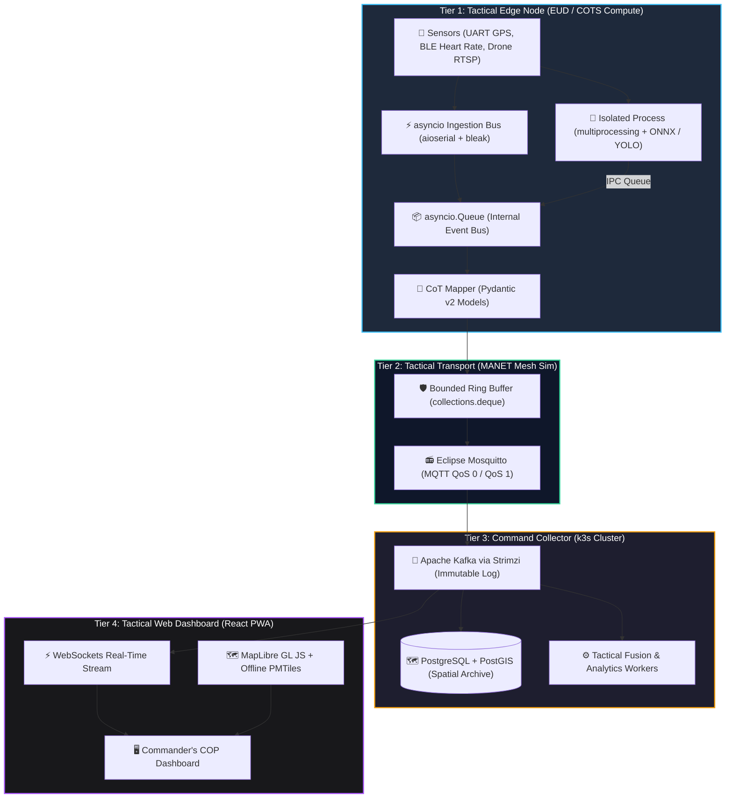

# 🦅 KestrelCOP

**Tactical Edge Telemetry Pipeline & Common Operating Picture (COP)**
*Offline-First • Open Data Standards (Cursor-on-Target) • COTS Hardware • Zero Cloud Lock-in*

[](https://github.com/FranekJemiolo/KestrelCOP/actions/workflows/ci.yml)
[](https://github.com/FranekJemiolo/KestrelCOP/actions/workflows/pages.yml)
[](LICENSE)
[](pyproject.toml)
[](docs/VISION.md)

---

## 🎯 Commander's Intent & Vision

**KestrelCOP** is an autonomous, open-source tactical telemetry pipeline and Common Operating Picture designed for **contested, degraded, and Disconnected, Intermittent, and Low-bandwidth (DIL)** environments.

Traditional military C4ISR systems rely on multi-million dollar prime contractor contracts, proprietary hardware, and fragile centralized cloud backhauls (AWS GovCloud, Azure Government). When electronic warfare, GPS denial, or physical isolation strikes, these systems fail.

KestrelCOP delivers a modern alternative:
- **Attritable & COTS-Ready:** Runs on low-cost commercial hardware (Raspberry Pi, NVIDIA Jetson, Android tablets).
- **Edge Intelligence:** Converts heavy drone video streams and sensor I/O into lightweight, standardized **Cursor-on-Target (CoT)** events locally—sending zero raw video over precious tactical radio spectrum.
- **100% Free & Open-Source:** Fully reproducible using Eclipse Mosquitto, Apache Kafka (Strimzi/k3s), PostGIS, MapLibre GL JS, and PMTiles.

👉 **Read the full operational blueprint in [docs/VISION.md](docs/VISION.md).**
🌐 **Live Architecture & Demo Portal:** [https://franekjemiolo.github.io/KestrelCOP/](https://franekjemiolo.github.io/KestrelCOP/)

---

## 🏗️ 4-Tier Architectural Topology



---

## 📦 System Stack Overview

| Tier | Component | Technology | Role |
| :--- | :--- | :--- | :--- |
| **Tier 1: Edge** | Ingestion & ML | `Python 3.12+`, `pydantic`, `aioserial`, `bleak`, `onnxruntime`, `opencv-python-headless` | Decoupled async I/O + multiprocessing inference; emits CoT JSON. |
| **Tier 2: Transport** | Mesh Radio | `Eclipse Mosquitto (MQTT)`, `aiomqtt`, bounded deque buffer | Reliable pub/sub across volatile MANET mesh networks. |
| **Tier 3: Collector** | Ingestion & Bus | `k3s`, `Apache Kafka (Strimzi)`, `PostgreSQL 16 + PostGIS 3.4` | High-throughput, immutable battlefield event streaming. |
| **Tier 4: Dashboard** | Geospatial COP | `React`, `TypeScript`, `MapLibre GL JS`, `PMTiles (Protomaps)` | Offline-first vector mapping and WebGL tactical symbology. |

---

## ⚡ Quickstart & Local Setup

### Prerequisites
- Python 3.12+
- [`uv`](https://github.com/astral-sh/uv) (recommended) or standard `pip`
- Git

### 1. Clone & Set Up Python Environment
```bash
git clone https://github.com/FranekJemiolo/KestrelCOP.git
cd KestrelCOP

# Install dependencies using uv
uv sync
```

### 2. Install Pre-commit Hooks
```bash
uv run pre-commit install
```

### 3. Run Quality Assurance Suite
```bash
# Run Ruff linting and formatting checks
uv run ruff check .
uv run ruff format --check .

# Run static type checking with Mypy (strict mode)
uv run mypy edge_node tests

# Execute test suite
uv run pytest
```

### 4. Run Edge Node Simulation
```bash
uv run python -m edge_node.main
```

---

## 📁 Repository Layout

```
KestrelCOP/
├── .github/
│   └── workflows/
│       ├── ci.yml              # Linting, formatting, type checking, and tests
│       └── pages.yml           # Automated deployment of docs to GitHub Pages
├── docs/
│   ├── VISION.md               # Operational Intent, Tier Specs, Validation Matrix
│   └── index.html              # GitHub Pages Interactive Tactical Dashboard
├── edge_node/
│   ├── __init__.py             # Edge Node Package
│   ├── models.py               # Pydantic Schemas (Location, Biometrics, Detection)
│   ├── cot_mapper.py           # Cursor-on-Target (CoT) JSON Serializer
│   └── main.py                 # Asyncio Event Loop & Concurrency Event Bus
├── tests/
│   ├── __init__.py
│   └── test_edge_node.py       # Unit tests for schemas, CoT mapping, and queues
├── .gitignore                  # Git hygiene rules
├── .pre-commit-config.yaml     # Ruff, Mypy, and pre-commit hooks
├── LICENSE                     # Apache License 2.0
├── pyproject.toml              # Dependencies & tool configurations
└── README.md                   # Project landing page
```

---

## 📜 License

Licensed under the **Apache License, Version 2.0**. See [LICENSE](LICENSE) for details.
