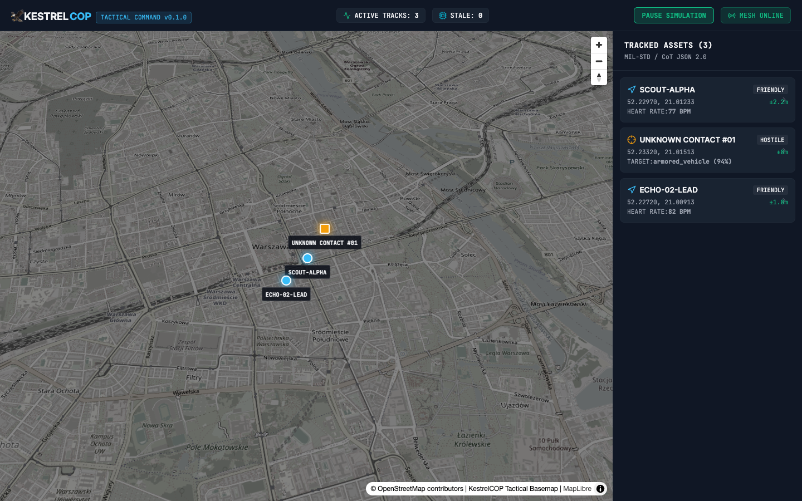
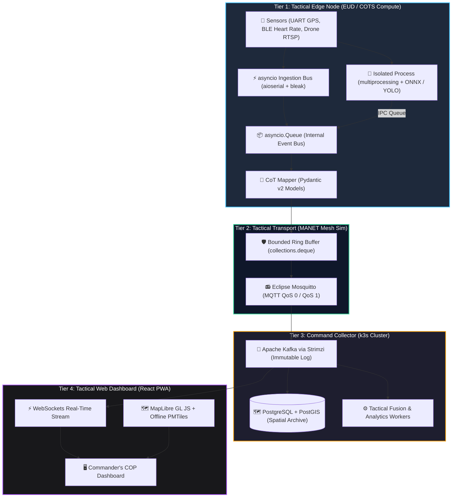
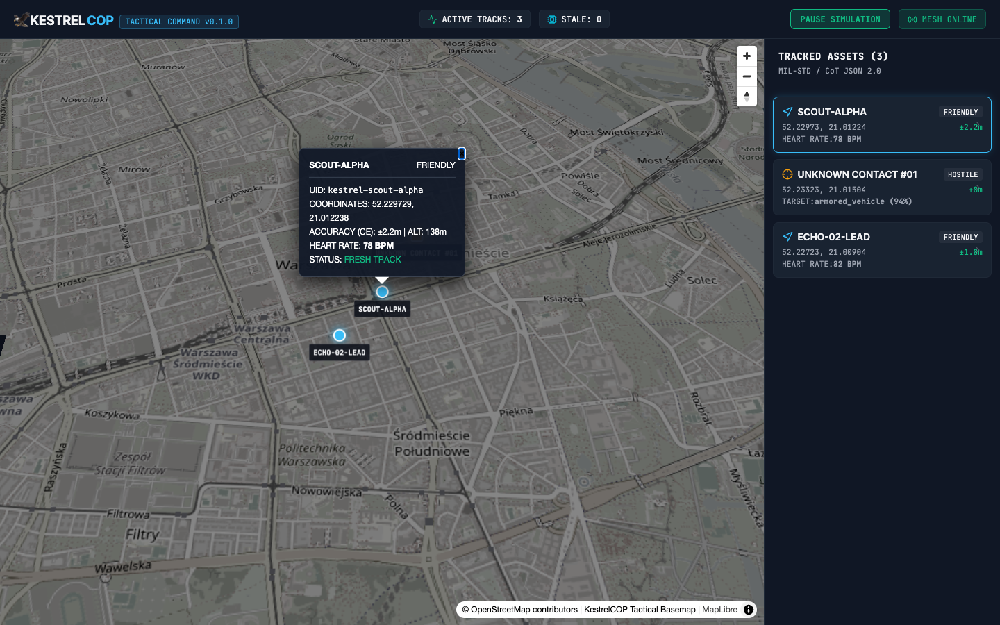
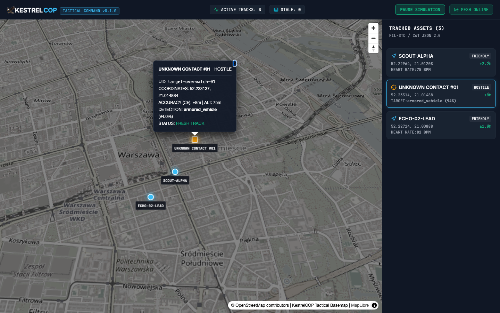
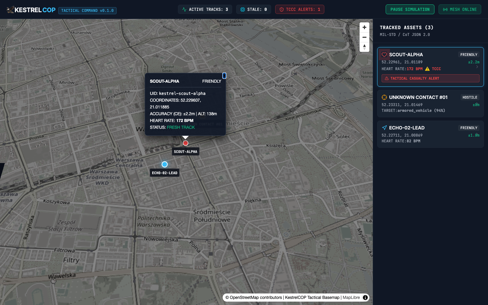

# 🦅 KestrelCOP

**Tactical Edge Telemetry Pipeline & Common Operating Picture (COP)**
*Offline-First • Open Data Standards (Cursor-on-Target) • COTS Hardware • Zero Cloud Lock-in*

[](https://github.com/FranekJemiolo/KestrelCOP/actions/workflows/ci.yml)
[](https://github.com/FranekJemiolo/KestrelCOP/actions/workflows/pages.yml)
[](LICENSE)
[](pyproject.toml)
[](docs/VISION.md)

---

## 🎯 Commander's Intent & Vision

**KestrelCOP** is an autonomous, open-source tactical telemetry pipeline and Common Operating Picture designed for **contested, degraded, and Disconnected, Intermittent, and Low-bandwidth (DIL)** environments.

Traditional military C4ISR systems rely on multi-million dollar prime contractor contracts, proprietary hardware, and fragile centralized cloud backhauls (AWS GovCloud, Azure Government). When electronic warfare, GPS denial, or physical isolation strikes, these systems fail.

KestrelCOP delivers a modern alternative:
- **Attritable & COTS-Ready:** Runs on low-cost commercial hardware (Raspberry Pi, NVIDIA Jetson, Android tablets).
- **Edge Intelligence:** Converts heavy drone video streams and sensor I/O into lightweight, standardized **Cursor-on-Target (CoT)** events locally—sending zero raw video over precious tactical radio spectrum.
- **100% Free & Open-Source:** Fully reproducible using Eclipse Mosquitto, Apache Kafka (Strimzi/k3s), PostGIS, MapLibre GL JS, and PMTiles.

👉 **Read the full operational blueprint in [docs/VISION.md](docs/VISION.md).**
🌐 **Live Architecture & Demo Portal:** [https://franekjemiolo.github.io/KestrelCOP/](https://franekjemiolo.github.io/KestrelCOP/)

[](docs/screenshots/kestrelcop_overview.png)

---

## 🏗️ 4-Tier Architectural Topology



---

## 📦 System Stack Overview

| Tier | Component | Technology | Role |
| :--- | :--- | :--- | :--- |
| **Tier 1: Edge** | Ingestion & ML | `Python 3.12+`, `pydantic`, `aioserial`, `bleak`, `onnxruntime`, `opencv-python-headless` | Decoupled async I/O + multiprocessing inference; emits CoT JSON. |
| **Tier 2: Transport** | Mesh Radio | `Eclipse Mosquitto (MQTT)`, `aiomqtt`, bounded deque buffer | Reliable pub/sub across volatile MANET mesh networks. |
| **Tier 3: Collector** | Ingestion & Bus | `k3s`, `Apache Kafka (Strimzi)`, `PostgreSQL 16 + PostGIS 3.4` | High-throughput, immutable battlefield event streaming. |
| **Tier 4: Dashboard** | Geospatial COP | `React`, `TypeScript`, `MapLibre GL JS`, `PMTiles (Protomaps)` | Offline-first vector mapping and WebGL tactical symbology. |

---

---

## 📸 Tactical Interface & Common Operating Picture

| **Tactical COP Overview** | **Operator Vitals & Tracking** |
| :---: | :---: |
| [](docs/screenshots/kestrelcop_overview.png) | [](docs/screenshots/kestrelcop_tactical_tracking.png) |
| *Dark tactical vector basemap with real-time MIL-STD Cursor-on-Target symbology and tracked asset drawer.* | *High-precision GPS tracking with circular error (CE), altitude, speed, and live BLE heart-rate biometric vitals.* |

| **ISR Drone Computer-Vision Detection** | **Tactical Combat Casualty Care (TCCC) Alert** |
| :---: | :---: |
| [](docs/screenshots/kestrelcop_drone_detection.png) | [](docs/screenshots/kestrelcop_tccc_alert.png) |
| *Edge ONNX/YOLO object detection: drone overwatch identifying hostile armored vehicle with 94% confidence.* | *Automated TCCC life-safety triage: pulsating red alert banner, high heart-rate alert, and urgent event routing.* |

---

## ⚡ Quickstart & Local Setup

### Prerequisites
- Python 3.12+
- Node.js 20+ & npm
- Go 1.24+
- [`uv`](https://github.com/astral-sh/uv) (recommended) or standard `pip`
- Git

### 1. Clone & Set Up Python Environment
```bash
git clone https://github.com/FranekJemiolo/KestrelCOP.git
cd KestrelCOP

# Install Python edge node dependencies using uv
uv sync
```

### 2. Install Pre-commit Hooks
```bash
uv run pre-commit install
```

### 3. Run Quality Assurance Suite
```bash
# Run Ruff linting and formatting checks
uv run ruff check .
uv run ruff format --check .

# Run static type checking with Mypy (strict mode)
uv run mypy edge_node tests

# Execute Python test suite
uv run pytest

# Execute Go backend tests
(cd backend && go test -v ./...)

# Verify frontend build
(cd frontend && npm run build)
```

### 4. Run Edge Node Simulation
```bash
uv run python -m edge_node.main
```

### 5. Run the Tactical Dashboard Locally

To run the complete tactical stack locally:

```bash
# Terminal 1: Launch Go Collector Backend (REST API & WebSockets)
cd backend
go run ./cmd/collector

# Terminal 2: Launch React Tactical PWA Dashboard
cd frontend
npm install
npm run dev
```

1. Navigate to **`http://localhost:3000`** in your browser.
2. Click **"SIMULATE TELEMETRY"** in the top navigation bar (or navigate to `http://localhost:3000/?sim=true`) to begin injecting synthetic multi-source tactical feeds.
3. Select any operator or contact from the right-hand **Tracked Assets** drawer or click directly on map markers to view real-time kinematics and biometrics.
4. Pass `&alert=true` in the URL to simulate active **Tactical Combat Casualty Care (TCCC)** life-safety casualty alarms.

### 6. Automated Screenshot Generation

The project includes a fully automated headless Chromium/Chrome screenshot pipeline located in `scripts/generate_screenshots.sh`:

```bash
./scripts/generate_screenshots.sh
```

**How It Works:**
- Automatically checks for and binds to an active Vite development server (or starts one temporarily on port 3000).
- Launches headless Chrome/Chromium (`--headless=new --window-size=1440,900 --virtual-time-budget=6000`).
- Cycles through operational COP states:
  1. `kestrelcop_overview.png`: Global COP layout with dark vector basemap and entity drawer.
  2. `kestrelcop_tactical_tracking.png`: Focused telemetry popup and vitals on operator `SCOUT-ALPHA`.
  3. `kestrelcop_drone_detection.png`: Computer-vision drone reconnaissance contact `target-overwatch-01`.
  4. `kestrelcop_tccc_alert.png`: Casualty triage alarm state with HUD warning and pulsating marker.
- Automatically saves and optimizes output PNGs into [`docs/screenshots/`](docs/screenshots/).

---

## 📁 Repository Layout

```
KestrelCOP/
├── .github/
│   └── workflows/
│       ├── ci.yml              # Linting, formatting, type checking, and tests
│       └── pages.yml           # Automated deployment of docs to GitHub Pages
├── backend/                    # Go Command Collector (MQTT, Kafka, PostGIS, WebSockets)
│   ├── cmd/collector/          # Collector main daemon
│   ├── pkg/kafka/              # Segmentio Kafka publisher, consumer, offset commit
│   ├── pkg/storage/            # PostGIS spatial repository & pool
│   ├── pkg/ws/                 # Real-time WebSocket distribution hub
│   └── Dockerfile              # Distroless static non-root container
├── docs/
│   ├── VISION.md               # Operational Intent, Tier Specs, Validation Matrix
│   ├── index.html              # GitHub Pages Interactive Tactical Dashboard
│   └── screenshots/            # High-resolution production COP screenshots
├── edge_node/                  # Python 3.12 Edge Node Package
│   ├── models.py               # Pydantic Schemas (Location, Biometrics, Detection)
│   ├── cot_mapper.py           # Cursor-on-Target (CoT) JSON Serializer
│   ├── publisher.py            # aiomqtt publisher with exponential backoff & ring buffer
│   ├── ml_worker.py            # Isolated OpenCV + ONNX Runtime YOLO process
│   └── main.py                 # Asyncio Event Loop & Concurrency Event Bus
├── frontend/                   # React 19 + TypeScript + MapLibre GL PWA
│   ├── src/components/         # TacticalMap, Header, TelemetryDrawer
│   └── vite.config.ts          # Vite configuration & PWA workbox setup
├── scripts/
│   └── generate_screenshots.sh # Automated headless browser screenshot generator
├── tests/
│   ├── __init__.py
│   └── test_edge_node.py       # Unit tests for schemas, CoT mapping, and queues
├── Dockerfile                  # Multi-stage slim Python edge node container
├── docker-compose.yml          # Local edge node, Mosquitto, and Vector stack
├── .pre-commit-config.yaml     # Ruff, Mypy, and pre-commit hooks
├── LICENSE                     # Apache License 2.0
├── pyproject.toml              # Dependencies & tool configurations
└── README.md                   # Project landing page
```


---

## 📜 License

Licensed under the **Apache License, Version 2.0**. See [LICENSE](LICENSE) for details.
